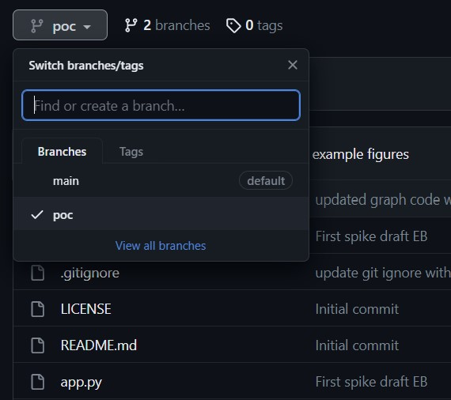
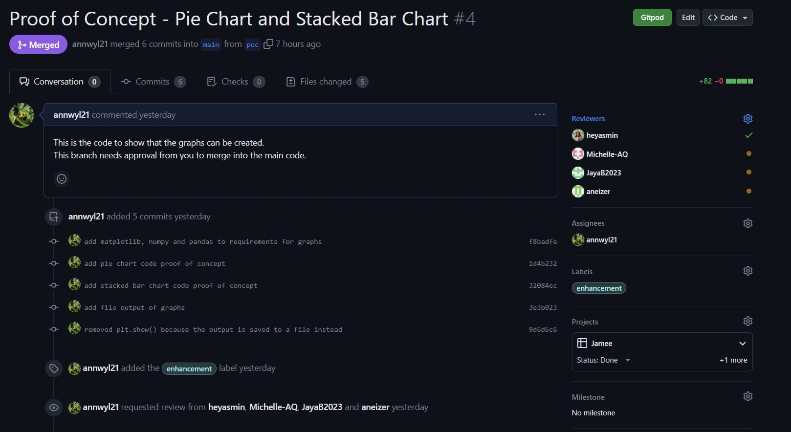

# jamee
A website/ dashboard for personal financial tracking

## Before Coding

```bash
git branch the_name_of_your_branch
git checkout the_name_of_your_branch
```

## To upload your code
```bash
git add the_filename
git commit -m "your_message"
git push origin
```

## To create a 'pull request' so you can merge your branch with the main and have others review the code.

- navigate to the repo on the web
- go to your branch where you have uploaded the code

- click the green pull request button
- add the pull request and tag the reviewers, tag yourself as an assignee and tag the project so we see it on the board

