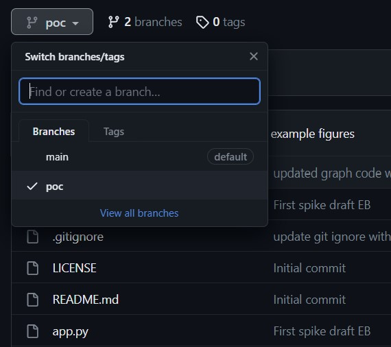
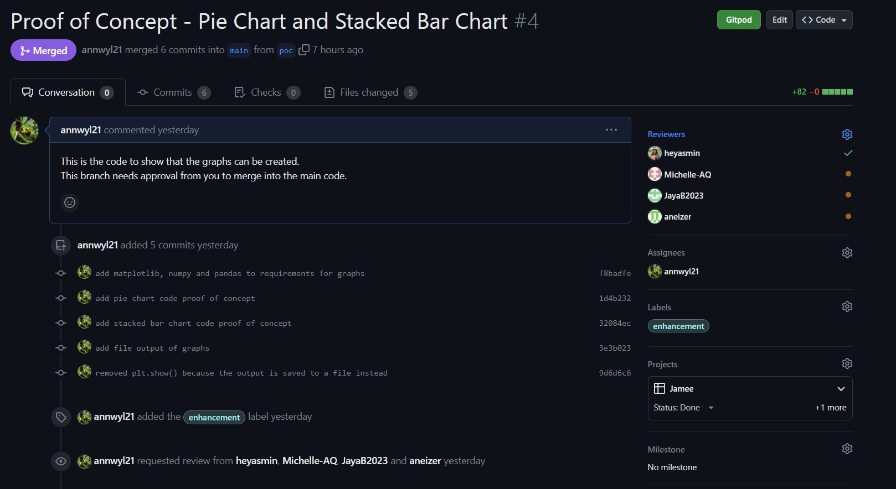

# Friends
A website / dashboard for personal financial tracking

- Install the requirements
```bash
pip install -r requirements.txt
```
- Create the database in MySql using the script: `application/static/scripts/jamee_user_database.sql`
- Run the app.py file to start the site locally
```bash
python -m flask run
```

# Problem-Solving

- Is flask started?
- Have you got the correct databse, no duplicates or old versions of the database?
    - Our Database code is held in Static/ Scripts
        - run `teardown_script.sql` to drop old versions of the database
        - run `jamee_user_database.sql` to rebuild the new database

## Before Coding

- PULL the most recent version of the code onto your MAIN branch
- STATUS to check which branch you are currently on
- CHECKOUT -b will create a new branch and switch you on to that branch

OR

- CHECKOUT (without -b) will switch you between the branches

```bash
git pull
git status

git checkout -b the_name_of_your_branch
OR
git checkout the_name_of_your_branch
```

## To upload your code

- the 1st time you upload to your new branch you need to tell github about the branch using the 'set upstream' command
    - there will be an onscreen prompt with the correct code to use
    - after that it will go back to being just 'git push origin'

```bash
git add the_filename
git commit -m "your_message"
git push origin

OR

git push --set-upstream origin the_name_of_your_branch
```

## To create a 'pull request' so you can merge your branch with the main and have others review the code.

- navigate to the repo on the web
- go to your branch where you have uploaded the code

- click the green pull request button
- add the pull request and tag the reviewers, tag yourself as an assignee and tag the project so we see it on the board



